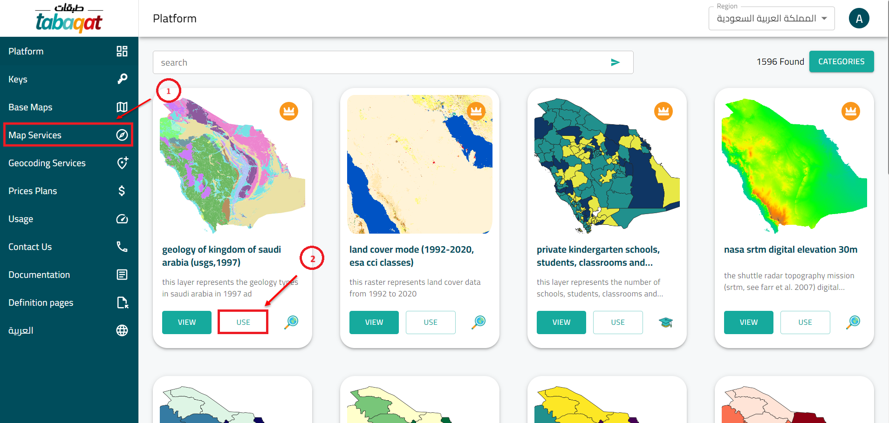
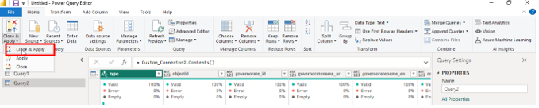
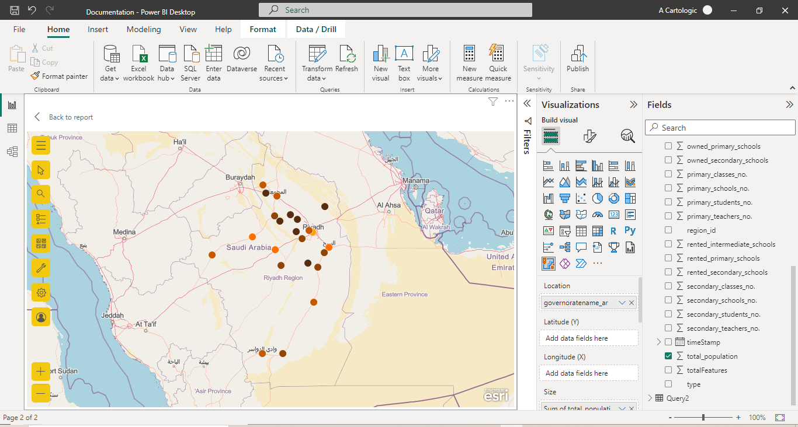

# <span style="color: #004D8D;">Develop PowerBI Web Data Connector
Estimated Reading : 30 minutes

## <span style="color: #004D8D;">Introduction
**PowerBi** Custom connector enables you to connect to [***tabaqat's***](https://tabaqat.net/) URLs. These URLs are used  to retrieve our data and use it in building visuals.

If you are a Power User or an Advanced User of Power BI, you may have your own secret **M** recipes to connect to your own data sources and do complex data transformations.

Then, why don't you **package** them and distribute them by developing Power BI Custom Connector? There are some advantages to do it.

   * You can hide all the details of **M** code and just expose the most important functions so that everyone can easily use it.
   * Users (including you) can add another operation on top of your **M** code easily and they don't have to touch your code.
   * You can delegate authentication to connector.


## <span style="color: #004D8D;">Prerequisites
* [	Power BI Desktop ](https://powerbi.microsoft.com/en-us/desktop/)  

* [	Visual Studio 2017](https://visualstudio.microsoft.com/vs/older-downloads/)  

* [	Power Query SDK](https://marketplace.visualstudio.com/items?itemName=Dakahn.PowerQuerySDK)  


Simply install them one by one by following wizards. 
___
## <span style="color: #004D8D;">how build you own URL ?
- Our API returns [**GeoJSON**](https://geojson.org/) format. You should be able to understand this format in order to decide which data to get and which to leave.
- Before start in **PowerBi** Desktop you need to get **URL** that gives you the data as a  GeoJSON file.

- We will return two tables inside **PowerBi** Desktop using our **tabaqat** API links :
```
https://data.tabaqat.net/geoserver/education-and-training/ows?service=WFS&version=1.0.0&request=GetFeature&typeName=education-and-training%3Aeducation-and-training_m3wpO118771&outputFormat=application%2Fjson&access_token=
https://data.tabaqat.net/geoserver/education-and-training/ows?service=WFS&version=1.0.0&request=GetFeature&typeName=education-and-training%3Aeducation-and-training_1YjB7179859&outputFormat=application%2Fjson&access_token={access_Token}
```
- The two API links contains data about **Riyadh** region. You can get these links using **tabaqat**. The links are missing access token at the end of each one. If you are a registered user at **tabaqat** you can get your access token and paste it at the end of the link after "**=**"

- After concate URL and access token , now you have full link that will return a GeoJSON file format that contains our data and use it in next steps .

- **Don't** worry if you read this and don't understand. Let us start with the steps to clarify everything

## <span style="color: #004D8D;">Let's start !

1-First navigate to [***tabaqat.net***](https://tabaqat.net/) and create an account if you don't have one.


2-After registering click login and sign with your email and password.


3-Change language to English.


4-Click on **Key** then **Generate Key**. As a free user you have up to five keys to generate.


5-Head to **Map Services** and select the layer you want to load inside **PowerBi** and then click "Use" .



6-Click on **MICROSOFT POWER BI** Then copy Url that contain your Generated access token .


## <span style="color: #004D8D;">Start from Power BI desktop
1-Open **PowerBi** Desktop and Connect to Web.


2-Paste access token from [***tabaqat.net***](https://tabaqat.net/) that mentioned later here.


3-**PowerBi** will forward you automatically to **Power Query editor**.


4-Press on **Advanced Editor**.


5-Copy [**M**](https://learn.microsoft.com/en-us/powerquery-m/) code from Advanced editor and put it in sticky note because you will use later.


6-While you open **PowerBI Desktop**, make sure you change Data Extension policy in security settings.


## <span style="color: #004D8D;">Develop Custom Connector

Now We convert (develop) above **M** code into custom connector.

## <span style="color: #004D8D;">Create project

1-Open **Visual Studio** 2017 and click "Create New Project".

2-Select **Data Connector Project** . If you don't see this, make sure to install **Power Query SDK** and restart Visual Studio.


3-Name the project and press **Ok**.


4-Visual Studio generates many files, but you just need to pay attention to two files.

* **.pq** file : This is where I write code.
* **.query.pq** file : This is where I test the code.

5-Open pq file. The syntax should be familiar as it's **M** language!

## <span style="color: #004D8D;">Migrate M code into pq file

1-First of all, copy and paste the **Get_tabqat1** function. I place it below **shared** section. One difference is I use **;** at the end of function. As I already show the code above, I put picture below to clarify where I put my code .

```power query
Get_tabqat1 = () as table =>
        let
            DefaultRequestHeaders = [
                #"Accept" = "application/json;odata.metadata=minimal",
                #"OData-MaxVersion" = "4.0"
            ],
            source = Web.Contents("https://data.tabaqat.net/geoserver/transportation/transportation_rjAZr139504/ows?service=WFS&version=1.0.0&request=GetFeature&typeName=transportation_rjAZr139504&outputFormat=application%2Fjson&access_token={YOUR_ACCESS_TOKEN}&AcceptLanguages=en", [ Headers=DefaultRequestHeaders ]),
            json = Json.Document(source),
            value = json[value],
            toTable = Table.FromList(value, Splitter.SplitByNothing(), null, null, ExtraValues.Error)
        in 
            toTable;
```
<br />
<br />


2-Next, migrate the rest of the code that we mention later by replaces existing code under shared keyword. Again, I place picture below.


#### That's it!

## <span style="color: #004D8D;">Test the code

1-Open *.query.pq file and confirm it calls the shared function.


2-Press F5 key to start test. The **M Query Output** window opens and asks credential first. Set **Anonymous** to credential type and click Set Credential.


3-Press **F5** again and you see the data comes back.


 Now you build your first connector.

## <span style="color: #004D8D;">Deploy

Last step is to deploy the connector.

1-Navigate to the project folder | bin | Debug. You can find ***.mez file.** There is a plan to change file extension so it could be different in the future.


2-Copy the file into **C:\users<user>\Documents\Power BI Desktop\Custom Connectors folder**. Create the folder if not exists.


#### That's it!


## <span style="color: #004D8D;">User in Power BI Desktop
1-Restart Power BI Desktop and start from **Get Data**.

2-Search for **"Custom_Connector"** and you should find your connector.


3-You will see **<span style="color: #FF0000;">WARNNING</span>** when connecting but just continue.


4-Only **anonymous** authentication is available. Click Connect.


5-Load the data or continue to transform if you want.


6-If you want to see the data that loaded you will find it at the right in **PowerBi**.


7-Repeat all above steps with another **URL** with the same **access token**.


8-delete **.mez** file from **Custom Connectors folder** and rebuild the script ,after rebuild the script but **.mez** In Custom Connectors folder.

9-Restart **PowerBi** Desktop and connect to **Custom_Connector** connector again.

10-Now you want to load data from second **URL** !

11-Click on Transform data in **PowerBi** ,this step will forward you to power query editor.


12-Click on Advanced Editor advanced_editor.


13-Copy **M** code and press **Done**.


14-from **New Sources** Click on **Blank Query** .


15-Click on Advanced Editor again and paste **M** code in it but this time will change in the name of function **Custom_Connector2** that will load the data from second **URL** and press **Done**.


16-Now you have two data sources from different URLs with the same access token.


17-Finally press on **�Close & Apply�** to load data in **PowerBi**.



18-to see data that loaded in **PowerBi** ,press on �Data�.


**Now you are ready to build visuals using PowerBi**.


19-To create Relationship between 2 tables ,press on model that appear on the left side ,
long prees on column that exsist in another table and match between them and finally press
**ok**.


20-Relationship will created automatic between 2 tables ,then prees **Ok**.


<br/>
<br/>


21-Build your visuals using the data.


<br/>
<br/>


